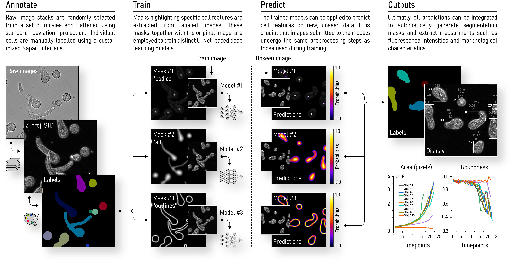

?logo=python&logoColor=rgb(149%2C157%2C165)&labelColor=rgb(50%2C60%2C65))
?logo=TensorFlow&logoColor=rgb(149%2C157%2C165)&labelColor=rgb(50%2C60%2C65))
?logo=NVIDIA&logoColor=rgb(149%2C157%2C165)&labelColor=rgb(50%2C60%2C65))
?logo=NVIDIA&logoColor=rgb(149%2C157%2C165)&labelColor=rgb(50%2C60%2C65))    
&color=rgb(149%2C157%2C165))
&color=rgb(149%2C157%2C165))
&color=rgb(149%2C157%2C165))    

# ETH-ScopeM_Gassler  
Spore germination analysis tool

## Index
- [Installation](#installation)
- [Usage](#usage)
- [Main procedure](#main-procedure)
- [Outputs](#outputs)
- [Comments](#comments)

## Installation

Pease select your operating system

<details> <summary>Windows</summary>  

### Step 1: Download this GitHub Repository 
- Click on the green `<> Code` button and download `ZIP` 
- Unzip the downloaded file to a desired location

### Step 2: Install Miniforge (Minimal Conda installer)
- Download and install [Miniforge](https://github.com/conda-forge/miniforge) for your operating system   
- Run the downloaded `.exe` file  
    - Select "Add Miniforge3 to PATH environment variable"  

### Step 3: Setup Conda 
- Open the newly installed Miniforge Prompt  
- Move to the downloaded GitHub repository
- Run one of the following command:  
```bash
# TensorFlow with GPU support
mamba env create -f environment_tf_gpu.yml
# TensorFlow with no GPU support 
mamba env create -f environment_tf_nogpu.yml
```  
- Activate Conda environment:
```bash
conda activate Gassler
```
Your prompt should now start with `(Gassler)` instead of `(base)`

</details> 

<details> <summary>MacOS</summary>  

### Step 1: Download this GitHub Repository 
- Click on the green `<> Code` button and download `ZIP` 
- Unzip the downloaded file to a desired location

### Step 2: Install Miniforge (Minimal Conda installer)
- Download and install [Miniforge](https://github.com/conda-forge/miniforge) for your operating system   
- Open your terminal
- Move to the directory containing the Miniforge installer
- Run one of the following command:  
```bash
# Intel-Series
bash Miniforge3-MacOSX-x86_64.sh
# M-Series
bash Miniforge3-MacOSX-arm64.sh
```   

### Step 3: Setup Conda 
- Re-open your terminal 
- Move to the downloaded GitHub repository
- Run one of the following command: 
```bash
# TensorFlow with GPU support
mamba env create -f environment_tf_gpu.yml
# TensorFlow with no GPU support 
mamba env create -f environment_tf_nogpu.yml
```  
- Activate Conda environment:  
```bash
conda activate Gassler
```
Your prompt should now start with `(Gassler)` instead of `(base)`

</details>

## Usage

### `preextract.py`
Read data from `remote_path`, format and save to `data_path`

- Paths
```bash
- remote_path     # str, path to remote directory
- data_path       # str, path to saving directory
- exclude         # list[str], exclude path(s) containing any of the str
```

- Parameters
```bash
- pixSize_out     # float, output pixel size (µm) 
```

### `main.py`
Read data from `data_path` and execute the [main procedure](#main-procedure)

- Paths
```bash
- remote_path     # str, path to remote directory
- data_path       # str, path to data directory
- target          # str, "all" or "image_name"
- overwrite       # bool, overwrite outputs
```
- Parameters
```bash
- threshAll       # float, threshold for "all" predictions
- threshOut       # float, threshold for "outlines" predictions
- threshBod       # float, threshold for "bodies" predictions
- min_size        # int, min. size for tracked objects
- min_roundness   # float, min. roundness for tracked objects
```

## Main procedure



## Outputs

### Images
```bash
- C1_proj.tif     # channel 1 (spores) std-projection
- C2_proj.tif     # channel 2 (bacteria) sum-projection
- display.tif     # tracked objects display
- labels.tif      # tracked objects labels
- composite.tif   # C1_proj + C2_proj + display
```

### Data
```bash
- data.pkl        # PKL file containing all data 
- area.csv        # tracked objects areas
- intensity.csv   # tracked objects C2 intensities 
- length.csv      # tracked objects length  
- roundness.csv   # tracked objects roundness
- plot.jpg        # all data plot
```

## Comments

- Features
    - Done
        - Background subtraction for channel #2
        - Measure object elongation
        - Remove border touching objects
        - Output CSV
        - Save plots as JPG
        - Object ID outputs & plots
    - To do
        - Remove early touching objects
        - Manually reject objects from analysis