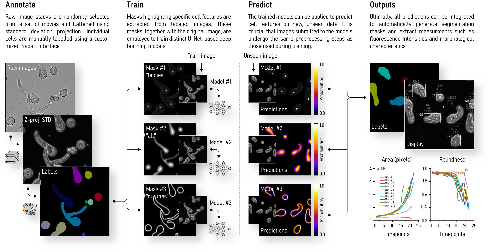

## Usage

### `preextract.py`
Read data from `remote_path`, format and save to `data_path`

- Paths
```bash
- remote_path     # str, path to remote directory
- data_path       # str, path to saving directory
- exclude         # list[str], exclude path(s) containing any of the str
```

- Parameters
```bash
- pixSize_out     # float, output pixel size (µm) 
```

### `main.py`
Read data from `data_path` and execute the [main procedure](#main-procedure)

- Paths
```bash
- remote_path     # str, path to remote directory
- data_path       # str, path to data directory
- target          # str, "all" or "image_name"
- overwrite       # bool, overwrite outputs
```
- Parameters
```bash
- threshAll       # float, threshold for "all" predictions
- threshOut       # float, threshold for "outlines" predictions
- threshBod       # float, threshold for "bodies" predictions
- min_size        # int, min. size for tracked objects
- min_roundness   # float, min. roundness for tracked objects
```

## Main procedure



## Outputs

### Images
```bash
- C1_proj.tif     # channel 1 (spores) std-projection
- C2_proj.tif     # channel 2 (bacteria) sum-projection
- display.tif     # tracked objects display
- labels.tif      # tracked objects labels
- composite.tif   # C1_proj + C2_proj + display
```

### Data
```bash
- data.pkl        # PKL file containing all data 
- area.csv        # tracked objects areas
- intensity.csv   # tracked objects C2 intensities 
- length.csv      # tracked objects length  
- roundness.csv   # tracked objects roundness
- plot.jpg        # all data plot
```